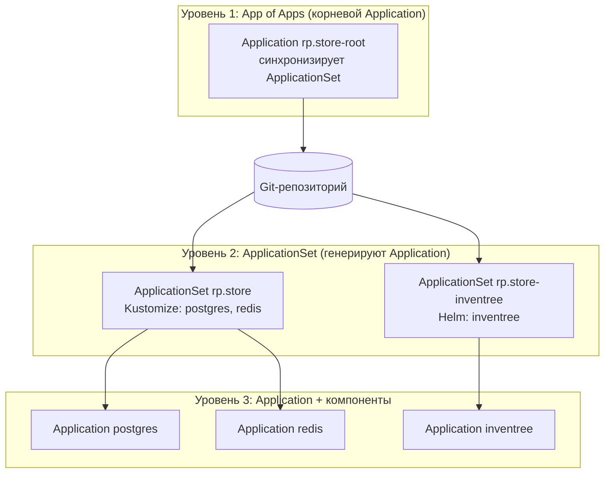

# Проект: conversavia-avia-k8s-manifects

> **Для кого этот файл:** для ИИ-агентов (нейронок) и новых разработчиков, которые впервые попадают в этот репозиторий. Здесь — общее описание проекта: задачи, цели и архитектура. Для точечных технических деталей (образы, репозитории, нешаблонные решения) смотрите **`AGENTS-REFERENCE.md`**.

---

## 1. Что это за проект

**conversavia-avia-k8s-manifects** — это GitOps-репозиторий Kubernetes-манифестов для развёртывания внутренней платформы **InvenTree** (open-source система управления складскими запасами) в локальном Kubernetes-кластере компании «Конверс Авия».

Доставка приложений в кластер управляется оператором **ArgoCD** (GitOps-подход): все манифесты лежат в Git, ArgoCD синхронизирует их с кластером. Изменения вносятся в Git и автоматически применяются в кластере.

Платформа разворачивается в одном неймспейсе **`inventree`**.

---

## 2. Задачи проекта

1. Развернуть InvenTree (веб-приложение управления запасами) в локальном кластере.
2. Обеспечить базу данных (PostgreSQL) и кеш (Redis) как сопутствующие сервисы.
3. Управлять всей системой через GitOps (ArgoCD) — «одной кнопкой».
4. Сделать инфраструктуру расширяемой: добавление новых сервисов не должно требовать ручного создания Application в GUI ArgoCD.

---

## 3. Цели проекта

- **Полная автоматизация развёртывания** через ApplicationSet / App-of-Apps.
- **Единый источник правды** — Git.
- **Масштабируемость** — поддержка нескольких окружений (dev/test/prod) без дублирования кода.
- **Воспроизводимость** — известные версии образов и зависимостей.

---

## 4. Архитектура системы

### 4.1. Компоненты платформы

Система состоит из трёх компонентов, развёрнутых в неймспейсе `inventree`:

| Компонент | Роль | Образ | Способ управления |
|---|---|---|---|
| **InvenTree** | Веб-приложение (Python/Django) | `ghcr.io/sharkdeveloper/rp.store/inventree` | Helm-чарт |
| **PostgreSQL** | База данных | `postgres:15-alpine` | Kustomize |
| **Redis** | Кеш | `redis:7-alpine` | Kustomize |

### 4.2. Три уровня управления (GitOps)

Архитектура управления построена в три уровня:



- **Уровень 1 (App of Apps)** — корневой Application, который применяет ApplicationSet-манифесты из Git. Именно его синка достаточно для запуска всей системы.
- **Уровень 2 (ApplicationSet)** — описывают, какие Application генерировать и из каких путей репозитория.
- **Уровень 3 (Application)** — реальные единицы синхронизации, каждый отвечает за свой компонент.

### 4.3. Связь компонентов

- **InvenTree** подключается к **PostgreSQL** по DNS-имени `postgres.inventree.svc.cluster.local:5432`.
- **InvenTree** подключается к **Redis** по DNS-имени `redis.inventree.svc.cluster.local:6379`.
- Данные (БД, кеш, файлы InvenTree) хранятся на локальных томах (StorageClass `local-path`).

---

## 5. Структура репозитория

```
conversavia-avia-k8s-manifects/
├── README.md                       # пользовательская инструкция
├── AGENTS-PROJECT.md               # этот файл: общее описание проекта
├── AGENTS-REFERENCE.md             # точечная техническая справка (образы, репозитории)
├── apps-of-apps/                   # корневой уровень: ApplicationSet'ы (App of Apps)
│   ├── appset-rp.store.yaml        # ApplicationSet: postgres + redis (Kustomize)
│   └── appset-rp.store-inventree.yaml  # ApplicationSet: inventree (Helm)
└── apps/
    ├── inventree/                  # InvenTree (Helm-чарт)
    │   ├── values-inventree.yaml           # реальные переопределения под кластер
    │   ├── inventree-default-values.yaml   # дефолтные values Helm-чарта
    │   ├── ingress-deploy.yaml             # доп. Ingress (для доступа по IP)
    │   └── certs/                          # TLS-сертификаты (⚠️ временно в git)
    ├── postgres/
    │   ├── kustomization.yaml
    │   ├── postgres.yaml            # Secret + PVC + Deployment + Service
    │   └── postgres-pv-25gi.yaml    # локальный PersistentVolume
    └── redis/
        ├── kustomization.yaml
        └── redis.yaml               # Secret + PVC + Deployment + Service
```

> **Принцип:** один компонент = одна папка в `apps/` = один Application в ArgoCD. Application'ы генерируются автоматически из `apps-of-apps/` через ApplicationSet.

---

## 6. Основные решения (кратко)

Полная детализация — в [`AGENTS-REFERENCE.md`](AGENTS-REFERENCE.md). Ключевое:

1. **ApplicationSet вместо ручных Application** — компоненты создаются автоматически.
2. **Разделение на два ApplicationSet** — из-за разницы типов source (Helm vs Kustomize). Подробности в справке.
3. **Образ InvenTree собственный** — собирается из форка `SharkDeveloper/rp.store` и публикуется в GHCR (а не берётся из официального Docker Hub).
4. **PostgreSQL — свой PVC на локальном диске** через явный `PersistentVolume` (local-storage) с привязкой к ноде.
5. **Redis с паролем** — через команду `redis-server --requirepass`.

---

## 7. Требования окружения

- Kubernetes-кластер (k3s / kind / minikube) со StorageClass `local-path` / `local-storage`.
- Установленный и настроенный **ArgoCD**.
- Ingress-контроллер **nginx**.
- Доступ к **GitHub Container Registry (ghcr.io)** для выкачивания образа InvenTree.
- Репозитории подключены в ArgoCD (Settings → Repositories).

---

## 8. Как запустить

Система запускается **двумя способами** — подробное описание, команды и сравнение см. в разделе «[Два способа запуска системы](AGENTS-REFERENCE.md#9-два-способа-запуска-системы)» технической справки.

### Способ 1 — CLI (`kubectl apply`)

```bash
kubectl apply -f apps-of-apps/appset-rp.store.yaml -n argocd
kubectl apply -f apps-of-apps/appset-rp.store-inventree.yaml -n argocd
```

### Способ 2 — App of Apps (GitOps, рекомендован)

Корневой Application `rp.store-root` отслеживает папку `apps-of-apps/` с ApplicationSet'ами и запускает весь стек одной кнопкой **Sync** в GUI.

После любого способа дождитесь статуса **Synced / Healthy** для `inventree`, `postgres`, `redis`.

---

## 9. Известные ограничения и TODO

- ⚠️ **Секреты в git** (пароли БД/Redis, TLS-ключ) — в открытом виде. Для продакшена — Vault / SealedSecrets / SOPS.
- ⚠️ **Одно окружение** — только `inventree`. Расширение до dev/test/prod планируется через ApplicationSet.
- ⚠️ **Хардкод** хостов `rp.store`, `192.168.5.87`, имени ноды `convers-avia-k8s-node` — при смене окружения нужно переопределять.
- ⚠️ **TLS-сертификаты** временно лежат в репозитории (см. [`certs/`](apps/inventree/certs)).
- ⚠️ **Доп. Ingress** `ingress-deploy.yaml` перехватывает любой Host — нужно убедиться, что нет конфликтов маршрутизации.